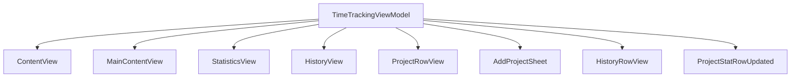
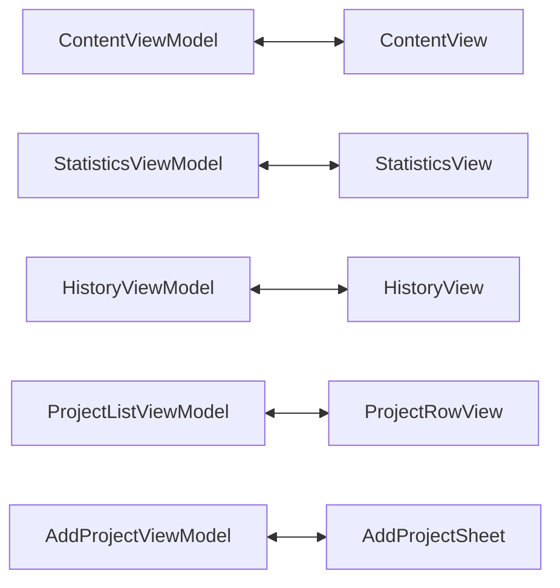

# View-ViewModel 1対1対応 設計書

## 現状分析

### 現在の問題点
- **単一巨大ViewModel**: `TimeTrackingViewModel`が全ての責務を持っている
- **責務の混在**: プロジェクト管理、時間記録、統計、履歴が1つのクラスに集約
- **テスト困難**: 巨大なViewModelで特定機能のテストが困難
- **再利用性低**: 特定のViewで必要ない機能も含んでしまう

### 現在のView-ViewModel関係



## 新しい設計

### 1対1対応の原則



### 新しいViewModel構造

#### 1. **ContentViewModel**
```swift
class ContentViewModel: ObservableObject {
  // 責務: メインアプリの状態管理とナビゲーション
  @Published var showingAddProject = false
  @Published var newProjectName = ""
  @Published var selectedColor = "blue"
  @Published var errorMessage: String?
  
  // 子ViewModelの管理
  let projectListViewModel: ProjectListViewModel
  let mainContentViewModel: MainContentViewModel
}
```

#### 2. **ProjectListViewModel**
```swift
class ProjectListViewModel: ObservableObject {
  // 責務: プロジェクト一覧とアクティブ状態の管理
  @Published var projects: [Project] = []
  @Published var currentTimeRecord: TimeRecord?
  
  func startTracking(for project: Project)
  func deleteProject(_ project: Project) 
  func getCurrentProject() -> Project?
}
```

#### 3. **AddProjectViewModel**
```swift
class AddProjectViewModel: ObservableObject {
  // 責務: プロジェクト作成
  @Published var projectName = ""
  @Published var selectedColor = "blue" 
  @Published var isLoading = false
  
  func createProject(name: String, color: String)
  func resetForm()
}
```

#### 4. **MainContentViewModel**
```swift
class MainContentViewModel: ObservableObject {
  // 責務: タブ管理と子ViewModelの統合
  @Published var selectedTab = 0
  
  let statisticsViewModel: StatisticsViewModel
  let historyViewModel: HistoryViewModel
}
```

#### 5. **StatisticsViewModel**
```swift
class StatisticsViewModel: ObservableObject {
  // 責務: 統計データの管理と計算
  @Published var todayProjectTimes: [(String, String, TimeInterval)] = []
  @Published var totalTodayTime: TimeInterval = 0
  @Published var isLoading = false
  
  func loadTodayStatistics()
  func refreshData()
}
```

#### 6. **HistoryViewModel**
```swift
class HistoryViewModel: ObservableObject {
  // 責務: 履歴データの管理と日付フィルタ
  @Published var selectedDate = Date()
  @Published var dayRecords: [TimeRecord] = []
  @Published var showingDatePicker = false
  @Published var isLoading = false
  
  func loadRecordsForDate(_ date: Date)
  func deleteRecord(_ record: TimeRecord)
}
```

### ViewModelの依存関係管理

#### Repository注入パターン
```swift
// 各ViewModelは必要なRepositoryのみを受け取る
class StatisticsViewModel {
  private let timeRecordRepository: TimeRecordRepositoryProtocol
  init(timeRecordRepository: TimeRecordRepositoryProtocol) { ... }
}

class ProjectListViewModel {
  private let projectRepository: ProjectRepositoryProtocol
  private let timeRecordRepository: TimeRecordRepositoryProtocol
  init(projectRepository: ProjectRepositoryProtocol, 
       timeRecordRepository: TimeRecordRepositoryProtocol) { ... }
}
```

#### ViewModelFactory
```swift
class ViewModelFactory {
  private let projectRepository: ProjectRepositoryProtocol
  private let timeRecordRepository: TimeRecordRepositoryProtocol
  
  func createContentViewModel() -> ContentViewModel { ... }
  func createStatisticsViewModel() -> StatisticsViewModel { ... }
  func createHistoryViewModel() -> HistoryViewModel { ... }
}
```

## リファクタリング計画

### フェーズ1: BaseViewModelの作成
1. 共通機能を持つ`BaseViewModel`作成
2. Repository注入の仕組み構築  
3. `ViewModelFactory`実装

### フェーズ2: 個別ViewModelの実装
1. `ProjectListViewModel`作成・実装
2. `AddProjectViewModel`作成・実装
3. `StatisticsViewModel`作成・実装
4. `HistoryViewModel`作成・実装
5. `ContentViewModel`作成・実装

### フェーズ3: Viewの更新
1. 各Viewを対応するViewModelに接続
2. 不要なプロパティ・メソッドの削除
3. ViewModel間の通信実装

### フェーズ4: 古いコードのクリーンアップ
1. 元の`TimeTrackingViewModel`削除
2. テストコードの更新
3. ドキュメントの更新

## メリット

### 🎯 **責務の分離**
- 各ViewModelが単一責務
- テストしやすく、理解しやすい

### 🔧 **保守性向上**
- バグの影響範囲が局所化
- 機能追加時の影響が最小限

### 🧪 **テスト性向上**
- 個別ViewModelのユニットテスト
- モック作成が容易

### ⚡ **パフォーマンス**
- 必要なデータのみロード
- 不要な再描画の削減

### 🚀 **スケーラビリティ**
- 新機能追加時の拡張が容易
- コンポーネントの再利用性向上

## ファイル構造（予定）

```
viewmodels/
├── base/
│   ├── BaseViewModel.swift
│   └── ViewModelFactory.swift
├── ContentViewModel.swift
├── ProjectListViewModel.swift  
├── AddProjectViewModel.swift
├── MainContentViewModel.swift
├── StatisticsViewModel.swift
└── HistoryViewModel.swift
```

## 実装ガイドライン

### 1. ViewModelの作成順序
各ViewModelは依存関係を考慮して以下の順序で実装する：

1. `BaseViewModel` (共通基盤)
2. `ProjectListViewModel` (最も独立性が高い)
3. `AddProjectViewModel` (ProjectListViewModelと連携)
4. `StatisticsViewModel` & `HistoryViewModel` (並行実装可能)
5. `MainContentViewModel` (Statistics/History ViewModelに依存)
6. `ContentViewModel` (全体統合)

### 2. データフロー


### 3. ViewModel間通信
- Combine Publisher-Subscriber パターン
- Delegation パターン
- NotificationCenter (最小限)

この設計により、各ViewとViewModelが1対1で対応し、責務が明確に分離された保守しやすいアーキテクチャが実現されます。

---
**作成日**: 2025年8月9日  
**作成者**: Claude Code  
**バージョン**: 1.0