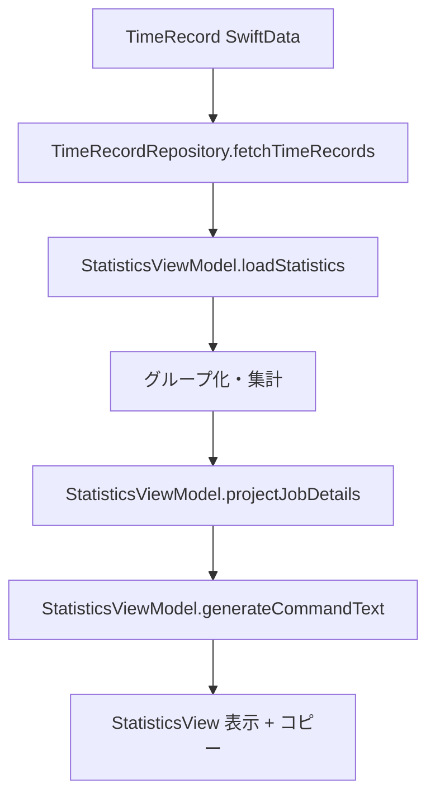
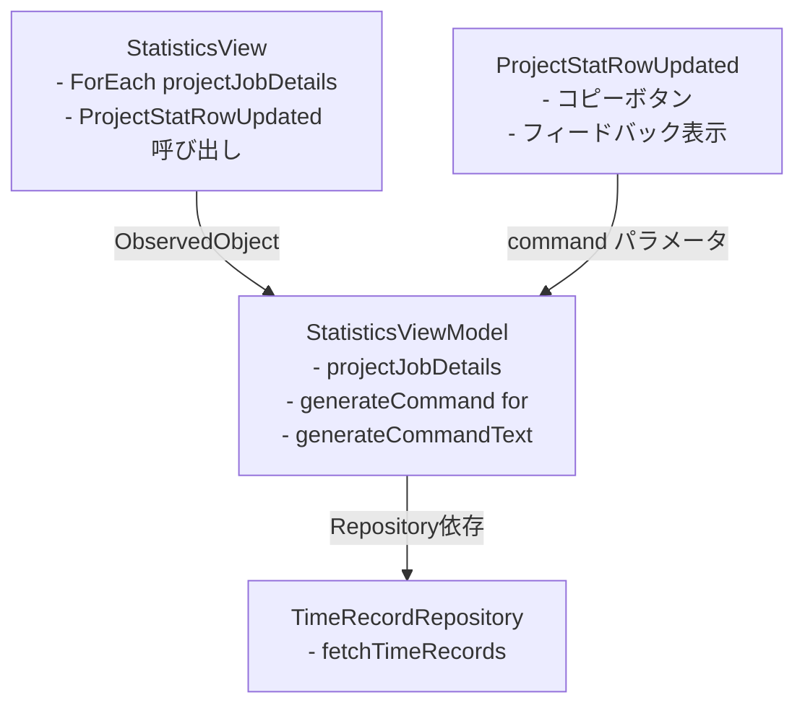

# 統計画面コマンド出力機能設計書

## 概要

統計画面に、案件・作業区分ペアごとの作業時間を外部ソフトウェア用のコマンド形式で出力する機能を追加する。

**作成日**: 2025/10/03
**最終更新**: 2025/10/03
**対象バージョン**: TimeRabbit v1.x

## 背景・目的

- ユーザーが外部ソフトウェアに作業時間データを入力する際の効率化
- 統計データを特定のコマンド形式で簡単にエクスポートできるようにする
- クリップボードへのコピー機能により、手作業での入力ミスを防止
- **外部ソフトウェアは1度に1コマンドのみ入力可能**なため、各案件・作業区分ごとに個別コピー機能が必要

## 要件

### 機能要件

1. **コマンド生成**
   - 選択された日付の統計データから、案件・作業区分ペアごとにコマンドを生成
   - コマンドフォーマット: `add yyyy/MM/dd [project ID] [job ID] [作業の%]`
   - パーセンテージは四捨五入した整数値

2. **表示機能**
   - 既存の案件・作業区分別作業時間リスト（ProjectStatRowUpdated）に統合
   - 各案件・作業区分行に個別のコピーボタンを配置
   - コマンドは非表示（コピー機能のみ提供）

3. **コピー機能**
   - 各案件・作業区分行ごとに個別のクリップボードコピーボタンを提供
   - コピー完了時に視覚的フィードバック（チェックマークアイコン + 「完了」テキスト）
   - フィードバックは2秒間表示後に自動的にリセット
   - 各行のコピー状態は独立して管理される

### 非機能要件

1. **パフォーマンス**
   - コマンド生成は既存の統計データ計算と同時に実施
   - UI のレスポンス性を損なわない

2. **ユーザビリティ**
   - 既存の「統計データ」セクションとの一貫性を保つ
   - コピー操作の成功/失敗がユーザーに明確に伝わる

3. **保守性**
   - 既存のアーキテクチャ（1:1 View-ViewModel MVVM）に準拠
   - 既存の統計データ生成ロジックを再利用

## アーキテクチャ設計

### データフロー



### コンポーネント間の関係



## 詳細設計

### データモデル

#### StatisticsViewModel の新規プロパティ

```swift
@Published var projectJobDetails: [(
  projectId: String,
  projectName: String,
  projectColor: String,
  jobId: String,
  jobName: String,
  duration: TimeInterval
)] = []
```

**設計理由**:
- 既存の `projectJobTimes` は名前のみを保持（後方互換性のため維持）
- `projectJobDetails` は ID 情報も含む詳細データを保持
- コマンド生成に必要な projectId と jobId を提供

### メソッド設計

#### StatisticsViewModel.generateCommand(for:)

```swift
func generateCommand(for detail: (projectId: String, projectName: String, projectColor: String, jobId: String, jobName: String, duration: TimeInterval)) -> String {
  let dateFormatter = DateFormatter()
  dateFormatter.dateFormat = "yyyy/MM/dd"
  let dateText = dateFormatter.string(from: dateService.selectedDate)
  let percentage = Int(round(getPercentage(for: detail.duration)))
  return "add \(dateText) \(detail.projectId) \(detail.jobId) \(percentage)"
}
```

**入力**: `projectJobDetails` の1要素（案件・作業区分ペアの詳細情報）
**出力**: 単一のコマンド文字列

**処理フロー**:
1. 選択された日付を `yyyy/MM/dd` 形式でフォーマット
2. パーセンテージを計算（`getPercentage()`を再利用）し、四捨五入して整数化
3. コマンド文字列を生成: `add [日付] [プロジェクトID] [ジョブID] [%]`

**出力例**:
```
add 2025/10/03 PRJ001 001 45
```

**設計理由**:
- 各案件・作業区分行ごとに個別のコマンドを生成するため
- UI コンポーネント（ProjectStatRowUpdated）がコマンドを受け取ってコピー機能を実装

#### StatisticsViewModel.generateCommandText()

```swift
func generateCommandText() -> String {
  let dateFormatter = DateFormatter()
  dateFormatter.dateFormat = "yyyy/MM/dd"
  let dateText = dateFormatter.string(from: dateService.selectedDate)

  var result = ""
  for detail in projectJobDetails {
    let percentage = Int(round(getPercentage(for: detail.duration)))
    result += "add \(dateText) \(detail.projectId) \(detail.jobId) \(percentage)\n"
  }

  return result.trimmingCharacters(in: .newlines)
}
```

**入力**: なし（ViewModelの内部状態を使用）
**出力**: コマンド形式の文字列（複数行）

**処理フロー**:
1. 選択された日付を `yyyy/MM/dd` 形式でフォーマット
2. `projectJobDetails` を反復処理
3. 各案件・作業区分ペアについて:
   - パーセンテージを計算（`getPercentage()`を再利用）
   - 四捨五入して整数化
   - コマンド文字列を生成: `add [日付] [プロジェクトID] [ジョブID] [%]`
4. 全コマンドを改行で結合して返却

**出力例**:
```
add 2025/10/03 PRJ001 001 45
add 2025/10/03 PRJ001 002 30
add 2025/10/03 PRJ002 001 25
```

### UI設計

#### ProjectStatRowUpdated の拡張

**配置位置**: 既存の案件・作業区分別作業時間リスト内（各行）

**新規追加パラメータ**:
- `command: String` - コピーするコマンド文字列

**構成要素**:

1. **既存レイアウト**
   - プロジェクト色サークル
   - プロジェクト名・作業区分名
   - 作業時間・パーセンテージ表示
   - プログレスバー

2. **新規追加: コピーボタン**
   - **配置位置**: 作業時間・パーセンテージ表示の右側
   - **デフォルト状態**: クリップボードアイコン（グレー）
   - **コピー完了状態**: チェックマークアイコン（緑色）+ 「完了」テキスト（緑色）
   - **ボタンスタイル**: borderless
   - **ツールチップ**: 「コマンドをクリップボードにコピー」 / 「コピーしました」

3. **状態管理**
   - `@State private var showCopiedFeedback = false`
   - 各行が独立してコピー状態を管理
   - コピーボタン押下時に `true` に設定
   - 2秒後に自動的に `false` に戻る

#### StatisticsView の変更

**変更点**:
- `projectJobTimes` から `projectJobDetails` を使用
- 各 `ProjectStatRowUpdated` に `command` パラメータを渡す
- コマンド生成は `viewModel.generateCommand(for: detail)` で行う

### データ集計ロジックの変更

#### loadStatistics() の変更点

**変更前**:
```swift
// プロジェクト名 + 作業区分でグループ化
let groupedRecords = Dictionary(grouping: completedRecords) { record in
  "\(record.displayProjectName)_\(record.displayJobName)_\(record.displayProjectColor)"
}
```

**変更後**:
```swift
// プロジェクトID + ジョブIDでグループ化
let groupedRecords = Dictionary(grouping: completedRecords) { record in
  "\(record.displayProjectId)_\(record.displayJobId)"
}
```

**変更理由**:
- プロジェクト名・ジョブ名は同じでも色が異なると別グループになる問題を修正
- ID ベースのグループ化により、より正確な集計が可能
- コマンド出力に必要な ID 情報を確実に取得

**統計データの生成**:
```swift
projectJobDetails = groupedRecords.map { (key, records) in
  let firstRecord = records.first!
  let projectId = firstRecord.displayProjectId
  let projectName = firstRecord.displayProjectName
  let projectColor = firstRecord.displayProjectColor
  let jobId = firstRecord.displayJobId
  let jobName = firstRecord.displayJobName
  let totalTime = records.reduce(0) { $0 + $1.duration }
  return (projectId, projectName, projectColor, jobId, jobName, totalTime)
}.sorted { $0.duration > $1.duration }

// 後方互換性のため、既存のprojectJobTimesも更新
projectJobTimes = projectJobDetails.map { detail in
  (detail.projectName, detail.jobName, detail.projectColor, detail.duration)
}
```

## 実装の詳細

### 実装ファイル

1. **StatisticsViewModel.swift**
   - `projectJobDetails` プロパティ追加
   - `loadStatistics()` メソッド更新（グループ化ロジック変更）
   - `generateCommand(for:)` メソッド追加（個別コマンド生成）
   - `generateCommandText()` メソッド追加（全コマンド生成、将来の拡張用）

2. **StatisticsView.swift**
   - `projectJobTimes` から `projectJobDetails` を使用するように変更
   - 各 `ProjectStatRowUpdated` に `command` パラメータを渡す

3. **ProjectStatRowUpdated.swift**
   - `command: String` パラメータ追加
   - `showCopiedFeedback` 状態変数追加
   - コピーボタンとフィードバック機能実装
   - `AppKit` インポート追加（`NSPasteboard` 使用のため）

### コピー機能の実装

```swift
Button(action: {
  Task {
    let text = viewModel.generateCommandText()
    let pasteboard = NSPasteboard.general
    pasteboard.clearContents()
    pasteboard.setString(text, forType: .string)

    await MainActor.run {
      showCommandCopiedFeedback = true
    }

    try? await Task.sleep(nanoseconds: 2_000_000_000)

    await MainActor.run {
      showCommandCopiedFeedback = false
    }
  }
})
```

**実装のポイント**:
- `NSPasteboard` を使用してクリップボードにコピー
- `Task` で非同期処理（UI のブロックを防止）
- `MainActor.run` で UI 更新をメインスレッドで実行
- 2秒間のスリープ後にフィードバックをリセット

## テスト計画

### ユニットテスト

1. **StatisticsViewModel.generateCommandText()**
   - 正常系: 複数の案件・作業区分ペアが正しくコマンド化される
   - 空データ: データがない場合は空文字列を返す
   - パーセンテージの丸め: 四捨五入が正しく行われる
   - 日付フォーマット: `yyyy/MM/dd` 形式で出力される

2. **StatisticsViewModel.loadStatistics()**
   - IDベースのグループ化が正しく動作する
   - `projectJobDetails` と `projectJobTimes` が正しく生成される

### 統合テスト

1. **UI表示テスト**
   - コマンド出力セクションが正しく表示される
   - コピーボタンが機能する
   - フィードバックが正しく表示・非表示される

2. **データ連携テスト**
   - 日付変更時にコマンドが再生成される
   - 統計データとコマンド出力の整合性

## 制約事項

1. **データの精度**
   - パーセンテージは四捨五入されるため、合計が100%にならない場合がある
   - 例: 33.3%, 33.3%, 33.4% → 33, 33, 33 (合計99%)

2. **コマンドフォーマット**
   - 外部ソフトウェアのコマンド仕様に完全に依存
   - プロジェクトID・ジョブIDにスペースが含まれる場合は考慮していない

3. **クリップボード**
   - macOS の NSPasteboard を使用（他プラットフォームでは動作しない）

## 将来の拡張性

1. **エクスポート形式の追加**
   - CSV形式
   - JSON形式
   - カスタムフォーマット対応

2. **コマンドテンプレート**
   - ユーザーが独自のコマンドフォーマットを定義できる機能

3. **バリデーション**
   - パーセンテージ合計が100%になるように自動調整

4. **履歴管理**
   - エクスポートしたコマンドの履歴を保存
   - 再エクスポート防止機能

## 実装時の設計変更

### 変更1: コマンド出力UIの配置変更

**当初設計**: 独立したコマンド出力セクションを追加
**変更後**: 既存のProjectStatRowUpdatedコンポーネントにコピーボタンを統合

**変更理由**:
- 外部ソフトウェアが1度に1コマンドのみ入力可能
- ユーザーは各案件・作業区分ごとに個別にコピーする必要がある
- 独立したセクションでは、どのコマンドがどの案件に対応するか視覚的に分かりにくい
- 既存の色付き行にコピーボタンを追加することで、視認性と操作性が向上

**メリット**:
- 案件・作業区分とコマンドの対応が明確
- UI の一貫性が保たれる
- スクロール量が減少

### 変更2: パーセンテージ表示の丸め処理統一

**問題**:
- 表示の%: `Int(percentage)` → 切り捨て（例: 33.7% → 33%）
- コマンドの%: `Int(round(percentage))` → 四捨五入（例: 33.7% → 34%）
- 結果として、画面表示とコピーされるコマンドの値が異なる不整合が発生

**修正内容**:
```swift
// 修正前
Text("\(Int(percentage))%")

// 修正後
Text("\(Int(round(percentage)))%")
```

**修正理由**:
- ユーザーが画面で確認した値とコピーされる値が異なると混乱を招く
- 四捨五入の方が数学的に正確
- StatisticsViewModel の `generateCommand(for:)` と表示ロジックを統一

**影響範囲**:
- ProjectStatRowUpdated.swift のパーセンテージ表示部分のみ

## テスト実装

### 実装されたテストケース

**ファイル**: `StatisticsViewModelCommandTests.swift`

1. **testGenerateCommandFormat** - コマンドフォーマットの検証
   - `add yyyy/MM/dd [projectId] [jobId] [percentage]` 形式を確認
   - 各コンポーネントが正しい値であることを検証
   - パーセンテージが0-100の範囲内であることを確認

2. **testGenerateCommandTextMultipleEntries** - 複数エントリのコマンド生成
   - 複数の案件・作業区分ペアからコマンドが生成されることを確認
   - 生成されるコマンド行数が `projectJobDetails` の数と一致することを検証
   - 各行のフォーマットが正しいことを確認

3. **testPercentageRounding** - パーセンテージの四捨五入検証
   - 33.3% → 33、66.7% → 67 への丸め処理を確認
   - `Int(round())` の動作を検証

4. **testEmptyData** - 空データの処理
   - データがない場合に空文字列が返されることを確認
   - `projectJobDetails` が空配列であることを検証

5. **testDateFormat** - 日付フォーマット検証
   - 異なる日付（2025/01/01、2025/10/03、2024/12/31）で正しくフォーマットされることを確認
   - `yyyy/MM/dd` 形式が守られることを検証

6. **testGroupingByProjectAndJob** - プロジェクト・ジョブごとのグループ化
   - 同じプロジェクトで異なるジョブの記録が別エントリになることを確認
   - 各コマンドに正しいジョブIDが含まれることを検証

**テスト結果**: 全36テスト成功（元の30テスト + 新規6テスト）

## 参考資料

- CLAUDE.md: プロジェクトの全体アーキテクチャ
- TimeRecord モデル (`Models.swift`): `displayProjectId`, `displayJobId` プロパティ
- 既存の統計データ出力機能 (`generateStatisticsText()`)
- ProjectStatRowUpdated コンポーネント: 案件・作業区分別作業時間の表示
