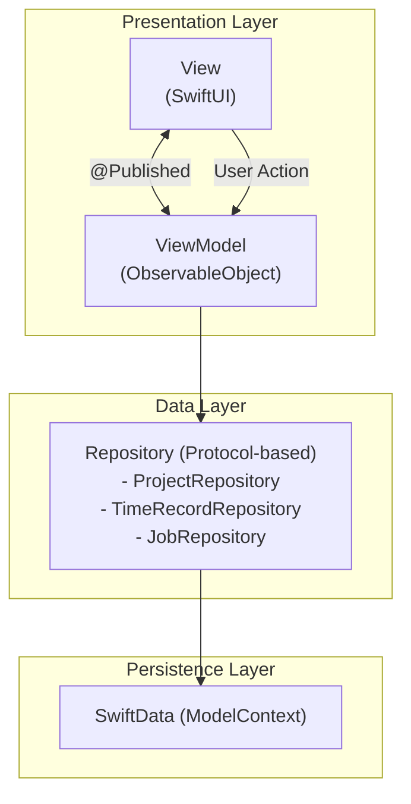
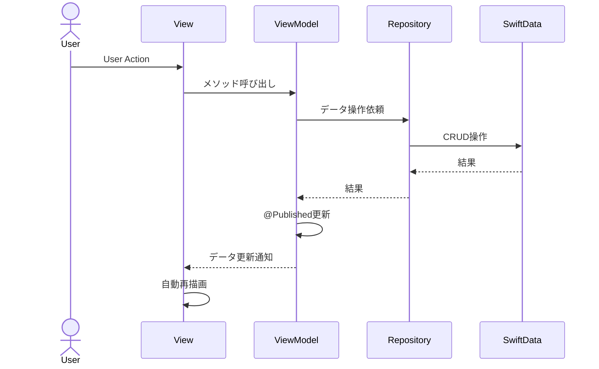

# TimeRabbit アーキテクチャガイド

**最終更新**: 2025年10月12日

---

## はじめに

このドキュメントでは、TimeRabbitのアーキテクチャについて詳しく解説します。TimeRabbitは **1:1 View-ViewModel MVVM パターン**を中核とした、保守性と拡張性に優れた設計を採用しています。

---

## アーキテクチャ概要

### レイヤー構成



---

## 1:1 View-ViewModel MVVM パターン

### 基本原則

**各ViewとViewModelが1対1で対応する厳格なMVVMパターン**

- 1つのViewは、専用のViewModelのみを参照
- ViewModelは複数のViewから共有しない
- 責務の明確な分離

### View-ViewModel対応表

| View | ViewModel | 責務 |
|------|-----------|------|
| `ContentView` | `ContentViewModel` | メインアプリケーションナビゲーション、プロジェクト一覧管理 |
| `MainContentView` | `MainContentViewModel` | タブ管理（統計/履歴）、子ViewModel統合 |
| `StatisticsView` | `StatisticsViewModel` | 日次統計データの管理と計算 |
| `HistoryView` | `HistoryViewModel` | 履歴データの管理と日付フィルタ |
| `EditHistorySheetView` | `EditHistoryViewModel` | 履歴レコードの編集 |
| `ProjectRowView` | `ProjectRowViewModel` | 個別プロジェクトの時間記録管理 |
| `AddProjectSheetView` | `AddProjectViewModel` | 新規プロジェクト作成 |

### 実装例

```swift
// ViewModel
@MainActor
class ContentViewModel: BaseViewModel {
  @Published var projects: [Project] = []
  private let repository: ProjectRepositoryProtocol

  init(repository: ProjectRepositoryProtocol) {
    self.repository = repository
    super.init()
  }
}

// View
struct ContentView: View {
  @ObservedObject var viewModel: ContentViewModel

  var body: some View {
    List(viewModel.projects) { project in
      Text(project.name)
    }
  }
}
```

---

## 依存性注入パターン

### ViewModelFactory（集中管理）

全ViewModelの生成を一元管理するファクトリパターンを採用しています。

```swift
class ViewModelFactory {
  private let projectRepository: ProjectRepositoryProtocol
  private let timeRecordRepository: TimeRecordRepositoryProtocol
  private let jobRepository: JobRepositoryProtocol
  private let dateService: DateService

  // 各ViewModelを作成するメソッド
  func createContentViewModel() -> ContentViewModel {
    ContentViewModel(repository: projectRepository)
  }

  func createStatisticsViewModel() -> StatisticsViewModel {
    StatisticsViewModel(
      repository: timeRecordRepository,
      dateService: dateService
    )
  }
  // ...
}
```

**利点:**
- 依存関係の集中管理
- テスト時のモック注入が容易
- 責務の明確な分離

**使用例:**
```swift
// AppでFactoryを作成
let factory = ViewModelFactory.create(
  with: (projectRepo, timeRecordRepo, jobRepo),
  dateService: dateService
)

// 各ViewModelを生成
let contentVM = factory.createContentViewModel()
let statisticsVM = factory.createStatisticsViewModel()
```

---

## BaseViewModel（共通基盤）

全ViewModelは`BaseViewModel`を継承し、共通機能を利用します。

### 提供機能

```swift
@MainActor
class BaseViewModel: ObservableObject {
  @Published var isLoading: Bool = false
  @Published var errorMessage: String?

  // 非同期処理のローディング管理
  func withLoading<T>(_ operation: @escaping () async throws -> T) async -> T?

  // 同期処理のローディング管理
  func withLoadingSync<T>(_ operation: () throws -> T) -> T?

  // エラーハンドリング
  func handleError(_ error: Error)
  func clearError()
}
```

### 使用例

```swift
class SomeViewModel: BaseViewModel {
  func performAction() {
    withLoadingSync {
      try repository.someOperation()
    }
  }

  func performAsyncAction() async {
    await withLoading {
      try await repository.asyncOperation()
    }
  }
}
```

---

## Repository Pattern（プロトコルベース）

データアクセス層は全てプロトコルとして定義され、実装とモックが明確に分離されています。

### プロトコル定義

```swift
protocol ProjectRepositoryProtocol {
  func fetchProjects() throws -> [Project]
  func createProject(projectId: String, name: String, color: String) throws -> Project
  func updateProject(_ project: Project, projectId: String, name: String, color: String) throws
  func deleteProject(_ project: Project) throws
  func isProjectIdUnique(_ projectId: String, excluding: Project?) throws -> Bool
}
```

### 実装とMock

```swift
// 実装（SwiftData使用）
class ProjectRepository: ProjectRepositoryProtocol {
  private let modelContext: ModelContext

  func fetchProjects() throws -> [Project] {
    let descriptor = FetchDescriptor<Project>(sortBy: [SortDescriptor(\.name)])
    return try modelContext.fetch(descriptor)
  }
  // ...
}

// モック（テスト・プレビュー用）
class MockProjectRepository: ProjectRepositoryProtocol {
  private var projects: [Project] = []

  func fetchProjects() throws -> [Project] {
    return projects
  }
  // ...
}
```

**利点:**
- テスタビリティの向上
- SwiftUIプレビューでの活用
- 実装の柔軟な切り替え

---

## レイヤー間の責務分離

### Presentation Layer (View + ViewModel)

**View (SwiftUI):**
- ✅ UI表示のみ
- ✅ ユーザー操作の受付
- ✅ ViewModelの状態を監視（`@ObservedObject`）
- ❌ ビジネスロジック
- ❌ データ永続化

**ViewModel:**
- ✅ ビジネスロジック
- ✅ 状態管理（`@Published`）
- ✅ Repositoryへのデータ要求
- ❌ UI描画
- ❌ データベース直接操作

### Data Layer (Repository)

**Repository:**
- ✅ データ永続化操作（CRUD）
- ✅ バリデーションロジック
- ✅ SwiftDataとの対話
- ❌ ビジネスロジック
- ❌ UI操作

### Persistence Layer (SwiftData)

**SwiftData:**
- データ永続化
- モデル管理
- リレーションシップ管理

---

## データフロー

### 基本フロー



1. ユーザーがViewで操作
2. ViewがViewModelのメソッド呼び出し
3. ViewModelがRepositoryにデータ操作を依頼
4. RepositoryがSwiftDataを操作
5. ViewModelの`@Published`プロパティが更新
6. Viewが自動的に再描画

### 具体例

```swift
// 1. ユーザーがボタンをタップ
Button("プロジェクト作成") {
  viewModel.createProject(name: "新規プロジェクト")
}

// 2. ViewModelがRepositoryに依頼
@MainActor
class ContentViewModel: BaseViewModel {
  func createProject(name: String) {
    withLoadingSync {
      let project = try repository.createProject(
        projectId: "PRJ001",
        name: name,
        color: "blue"
      )
      // 3. @Publishedプロパティが更新
      projects.append(project)
    }
  }
}

// 4. Viewが自動再描画（Combineによる）
```

---

## 設計思想

### 1. 単一責任の原則（SRP）

各コンポーネントは**単一の明確な責務**を持ちます。

| コンポーネント | 責務 |
|--------------|------|
| View | UI表示、ユーザー操作の受付 |
| ViewModel | ビジネスロジック、状態管理 |
| Repository | データ永続化操作 |
| Model | データ構造の定義 |

### 2. 統一識別子システム

**2種類の識別子**を厳密に使い分けます：

#### UUID `id`（システム内部管理用）

```swift
@Model
final class Project {
  var id: UUID             // システム内部の一意識別子
  var projectId: String    // ユーザー編集可能な案件ID
}
```

**用途:**
- オブジェクトの同一性確認
- 削除・比較操作
- SwiftDataの`persistentModelID`とは独立

#### String `projectId` / `jobId`（ビジネスロジック用）

**用途:**
- ユーザー向け表示
- ビジネスロジック検索
- 統計集計時の同一性確認

**使い分けルール:**

```swift
// ✅ 正しい使用例
projects.removeAll { $0.id == project.id }              // UUID for identity
let proj = projects.first { $0.projectId == "PRJ001" }  // String for business

// ❌ 間違った使用例
projects.removeAll { $0.projectId == project.projectId } // BUG!
```

### 3. 防御的設計（Defensive Design）

TimeRecordは、ProjectやJobが削除されても情報を保持します。

```swift
@Model
final class TimeRecord {
  var project: Project?
  var job: Job?

  // Backup data for deleted entities
  var backupProjectId: String
  var backupProjectName: String
  // ...

  var displayProjectName: String {
    project?.name ?? backupProjectName
  }
}
```

**メリット:**
- データ損失の防止
- 削除後も履歴の完全性を維持

### 4. 共有状態管理（Services Layer）

アプリケーション全体で使用される共通サービスを`services/`ディレクトリに集約しています。

#### DateService
統計画面と履歴画面の日付選択を同期：

```swift
@MainActor
class DateService: ObservableObject {
  @Published var selectedDate: Date = Calendar.current.startOfDay(for: Date())
}
```

#### Logger (AppLogger)
OSLogベースの構造化ロギング：

```swift
AppLogger.viewModel.debug("Action performed")
AppLogger.repository.info("Data saved")
AppLogger.app.error("Error occurred: \(error)")
```

**カテゴリ:**
- `app`: アプリケーションレベル
- `repository`: リポジトリ操作
- `viewModel`: ViewModel操作
- `swiftData`: SwiftData操作

### 5. テスト駆動開発（TDD思考）

全RepositoryにMock実装が存在：

```swift
// SwiftUIプレビュー
#Preview {
  let mockRepo = MockProjectRepository(withSampleData: true)
  ContentView(viewModel: ContentViewModel(repository: mockRepo))
}

// ユニットテスト
@Test("Project creation")
func testCreateProject() {
  let mockRepo = MockProjectRepository(withSampleData: false)
  let vm = ContentViewModel(repository: mockRepo)
  // ...
}
```

### 6. コード品質管理

#### SwiftFormat
プロジェクト全体で統一されたコードスタイルを保証：

- `.swiftformat`設定ファイルで一元管理
- `--self insert`: 全メンバー参照に明示的な`self.`を追加（Swift 6互換性）
- Pre-pushフックで自動チェック

```bash
# 手動フォーマット
swiftformat .

# チェックのみ
swiftformat --lint .
```

#### Pre-push フック
Push前に自動的に以下をチェック：

1. **SwiftFormat**: コードフォーマット
2. **Unit Tests**: 全ユニットテスト実行

フォーマットやテストが失敗した場合、Pushはブロックされます。

---

## 設計パターンカタログ

詳細は [../reference/design-patterns.md](../reference/design-patterns.md) を参照してください。

- **MVVM**: Presentation層の設計
- **Repository Pattern**: Data層の設計
- **Factory Pattern**: 依存性注入
- **Protocol-Oriented Programming**: テスタビリティ向上
- **Defensive Design**: データ整合性保証

---

## 関連ドキュメント

### ガイド
- [project-overview.md](project-overview.md) - プロジェクト全体概要
- [development-guide.md](development-guide.md) - 開発ガイド

### リファレンス
- [../reference/data-models.md](../reference/data-models.md) - データモデル詳細
- [../reference/tech-stack.md](../reference/tech-stack.md) - 技術スタック

### 設計書
- [../design/20250926-view-viewmodel-1to1-design.md](../design/20250926-view-viewmodel-1to1-design.md) - 1:1設計の詳細
- [../design/20251008-project-job-systemid-design.md](../design/20251008-project-job-systemid-design.md) - 識別子システム設計
