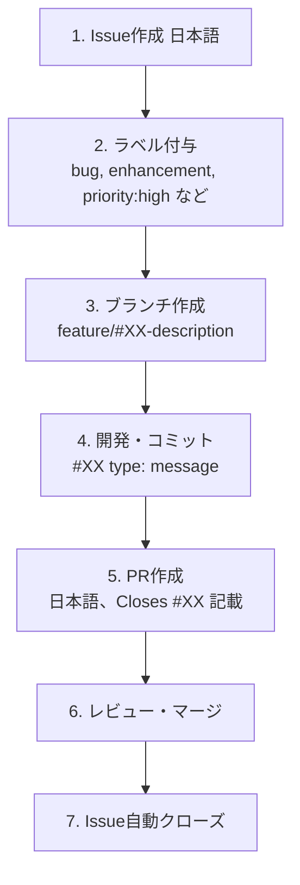
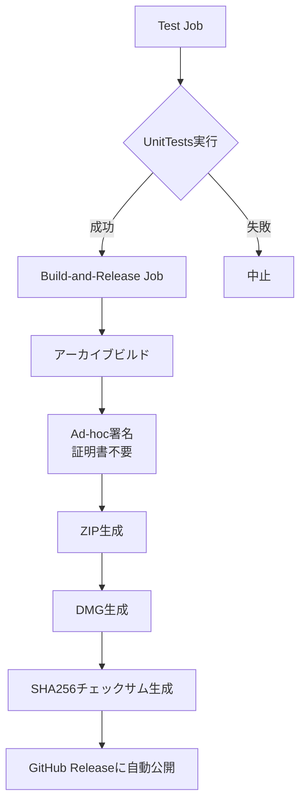

# TimeRabbit 開発フロー

**最終更新**: 2025年10月12日

---

## Git運用規約

### ブランチ戦略


#### ブランチの役割

| ブランチ | 役割 | 保護 | デプロイ |
|---------|------|------|---------|
| `main` | 本番リリース専用 | ✅ | タグpushで自動デプロイ |
| `develop` | 統合ブランチ | ✅ | - |
| `feature/#XX-name` | 機能開発 | - | - |
| `bugfix/#XX-name` | バグ修正 | - | - |
| `hotfix/#XX-name` | 緊急修正（mainから分岐） | - | - |

### ブランチ命名規則

```
feature/#XX-short-description
bugfix/#XX-short-description
hotfix/#XX-short-description
```

**例:**
- `feature/#14-add-dark-mode`
- `bugfix/#15-fix-time-validation`
- `hotfix/#23-critical-data-loss`

---

## コードフォーマット

### SwiftFormat

プロジェクト全体で統一されたコードスタイルを維持するため、SwiftFormatを使用しています。

#### 設定ファイル

`.swiftformat`で一元管理：

```
--swiftversion 5.0
--self insert           # 明示的なself.を追加（Swift 6互換性）
--enable isEmpty
--enable sortImports
```

#### フォーマット実行

```bash
# 全ファイルをフォーマット
swiftformat .

# チェックのみ（変更なし）
swiftformat --lint .

# 特定ファイルのみ
swiftformat TimeRabbit/viewmodels/ContentViewModel.swift
```

#### Pre-pushフック

**重要**: Push前に自動的に以下がチェックされます：

1. **SwiftFormat**: コードフォーマット
2. **Unit Tests**: 全ユニットテスト実行

フォーマットやテストが失敗した場合、Pushはブロックされます。

```bash
# .git/hooks/pre-push が自動実行
Running SwiftFormat before push...
✅ SwiftFormat check passed!

Running unit tests before push...
✅ Unit tests passed!

All pre-push checks passed. Proceeding with push...
```

#### フォーマット失敗時の対処

```bash
# エラーが出た場合
❌ SwiftFormat made changes to your code.

# 変更を確認
git diff

# フォーマットを適用してコミット
swiftformat .
git add -A
git commit -m "chore: Apply SwiftFormat"
git push
```

---

## コミットメッセージ規約

### フォーマット

```
#[issue_number] [type]: [message]

# issue番号がない場合は省略
[type]: [message]
```

**注意**: Issue番号がない場合は`#0`ではなく、完全に省略してください。

### タイプ一覧

| タイプ | 用途 | 例 |
|--------|------|-----|
| `feature` | 新機能実装 | `#14 feature: Add dark mode toggle` |
| `bugfix` | バグ修正 | `#15 bugfix: Fix time overlap validation` |
| `hotfix` | 緊急修正 | `#23 hotfix: Resolve critical data loss` |
| `docs` | ドキュメント変更 | `#8 docs: Update architecture documentation` |
| `refactor` | リファクタリング | `#10 refactor: Simplify ViewModel factory` |
| `test` | テスト関連 | `#12 test: Add statistics command tests` |
| `chore` | ビルド・ツール変更 | `#9 chore: Update Xcode project settings` |

### 良いコミットメッセージの例

```
#2 feature: Unify identifier naming with UUID-based id
#15 bugfix: Fix time overlap validation logic
#23 hotfix: Resolve critical data loss issue in repository
#8 docs: Update architecture documentation with new design
#10 refactor: Extract BaseViewModel from individual ViewModels
```

---

## Issue/PR管理

### 言語ポリシー

| 項目 | 言語 | 理由 |
|------|------|------|
| **GitHub Issue** | 日本語 | チーム内コミュニケーション |
| **Pull Request** | 日本語 | レビュー効率化 |
| **コミットメッセージ** | 英語 | Git履歴の標準化 |
| **コード・コメント** | 英語 | 国際的な可読性 |

### Issue workflow



### Issueテンプレート例

```markdown
Title: リリースビルドがmacOS Gatekeeperで「壊れている」と表示される問題

## 概要
GitHub Releaseからダウンロードしたアプリが起動できない

## 現在の動作
1. GitHub ReleaseからZIPをダウンロード
2. 展開してアプリをダブルクリック
3. 「壊れているため開けません」エラーが表示される

## 期待される動作
- アプリが正常に起動する
- または適切な回避策の提示

## 環境
- macOS: 14.0 (Sonoma)
- ダウンロード元: GitHub Release v0.1.0
```

### PRテンプレート例

```markdown
Title: Gatekeeper対応の改善（Phase 1 & 2）

Closes #5

## 概要
リリースノートにGatekeeper警告を追加し、ad-hoc署名プロセスを改善します。

## 変更内容
- リリースノートに回避策を追加（xattr -cr コマンド）
- 署名検証ステップを追加
- DMG作成プロセスの改善

## テスト
- [x] ローカルビルドで動作確認
- [x] GitHub Actionsでビルド成功
- [x] macOS 14.0でGatekeeper警告を確認
```

---

## CI/CD パイプライン

### CI (`.github/workflows/ci.yml`)

#### トリガー条件

```yaml
on:
  pull_request:
    branches: [ main ]
    paths:
      - '**.swift'
      - 'TimeRabbit.xcodeproj/**'
      - 'TimeRabbitTests/**'
  push:
    branches: [ main ]
```

#### 実行内容

```bash
# 実行環境
- macOS 15
- Xcode 16.4

# テストコマンド
xcodebuild test \
  -project TimeRabbit.xcodeproj \
  -scheme TimeRabbit \
  -destination 'platform=macOS' \
  -testPlan TimeRabbitTests \
  -enableCodeCoverage YES
```

**特徴:**
- UnitTestsのみ実行（UITests除外）
- コードカバレッジ有効
- 実行時間: 約0.1秒
- テスト失敗時はPRマージ不可

### Release (`.github/workflows/release.yml`)

#### トリガー条件

```bash
# バージョンタグをpush
git tag -a v0.1.0 -m "Release v0.1.0"
git push origin v0.1.0
```

#### 処理フロー



#### 成果物

- `TimeRabbit-X.X.X.zip`
- `TimeRabbit-X.X.X.dmg`
- `TimeRabbit-X.X.X.zip.sha256`
- 自動生成されたリリースノート（Gatekeeper警告含む）

---

## テスト戦略

### テスト構成

```
TimeRabbitTests/        ← ✅ 実行対象（UnitTests）
├── TimeRabbitTests.swift
├── EditHistoryViewModelTests.swift
├── EditHistoryViewModelSimpleTests.swift
├── MainContentViewModelTests.swift
└── StatisticsViewModelCommandTests.swift

TimeRabbitUITests/      ← ❌ 実行除外
└── (UIテストファイル)
```

### 実行コマンド

```bash
# UnitTestsのみ（推奨）
xcodebuild test \
  -project TimeRabbit.xcodeproj \
  -scheme TimeRabbit \
  -destination 'platform=macOS' \
  -testPlan TimeRabbitTests

# 実行時間: 約0.1秒（UITests含む場合は数分）
```

### テスト設計原則

#### 1. 過去日付の使用

```swift
// ❌ 未来時刻エラーが発生
let record = TimeRecord(startTime: Date(), project: proj, job: job)

// ✅ 過去日付を使用
let pastDate = Calendar.current.date(byAdding: .day, value: -1, to: Date())!
let record = TimeRecord(startTime: pastDate, project: proj, job: job)
```

**理由:** `validateTimeRange()`が未来時刻を拒否するため

#### 2. Mock Repository使用

```swift
@Test("Project creation test")
func testCreateProject() {
  // 空の状態でテスト
  let mockRepo = MockProjectRepository(withSampleData: false)

  let project = try mockRepo.createProject(
    projectId: "P001",
    name: "Test",
    color: "blue"
  )

  #expect(project.projectId == "P001")
}
```

#### 3. Swift Testing Framework

```swift
// ✅ Swift Testing使用
import Testing

@Suite("Project Tests")
struct ProjectTests {
  @Test("Create project with valid data")
  func testCreateProject() { ... }
}

// ❌ XCTest は使用しない
```

#### 4. 1 ViewModel = 1 Test Suite

```swift
@Suite("ContentViewModel Tests")
struct ContentViewModelTests { ... }

@Suite("StatisticsViewModel Tests")
struct StatisticsViewModelTests { ... }
```

---

## リリース手順

### 1. 準備（developブランチ）

```bash
# テストが全て成功することを確認
xcodebuild test -project TimeRabbit.xcodeproj \
  -scheme TimeRabbit -destination 'platform=macOS' \
  -testPlan TimeRabbitTests

# 全ての変更がコミット済みであることを確認
git status
```

### 2. PR作成（develop → main）

```bash
gh pr create \
  --base main \
  --head develop \
  --title "Release v0.1.0" \
  --body "Closes #XX"
```

### 3. PRマージ

- レビュー完了後、mainへマージ
- Issue自動クローズ

### 4. バージョンタグ作成

```bash
# mainブランチに移動
git checkout main
git pull origin main

# タグ作成（Semantic Versioning）
git tag -a v0.1.0 -m "Release v0.1.0"

# タグをpush（GitHub Actionsが自動実行）
git push origin v0.1.0
```

### 5. GitHub Actions自動実行

1. Test Job実行
2. Build-and-Release Job実行
3. GitHub Releaseに自動公開

### 6. developブランチ同期

```bash
# mainの変更をdevelopに反映
git checkout develop
git merge main
git push origin develop
```

### 7. Issueへのコメント

クローズされたIssueにリリースバージョンをコメント：
```
v0.1.0 でリリースされました
```

---

## バージョニング

### Semantic Versioning

```
v{MAJOR}.{MINOR}.{PATCH}
```

| 番号 | 用途 | 例 |
|------|------|-----|
| MAJOR | 破壊的変更 | データ構造の大幅変更 |
| MINOR | 新機能追加（後方互換） | 新しい統計機能追加 |
| PATCH | バグ修正 | 時間検証ロジック修正 |

**例:**
- `v0.1.0` → `v0.2.0`: 新機能追加
- `v0.2.0` → `v0.2.1`: バグ修正
- `v0.2.1` → `v1.0.0`: 破壊的変更

---

## 関連ドキュメント

- [operations/release-deployment-procedure.md](operations/release-deployment-procedure.md): 詳細なリリース手順
- [operations/github-actions-cicd.md](operations/github-actions-cicd.md): CI/CD設定詳細
- [CLAUDE.md](../CLAUDE.md): 開発ガイド全般
