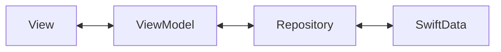
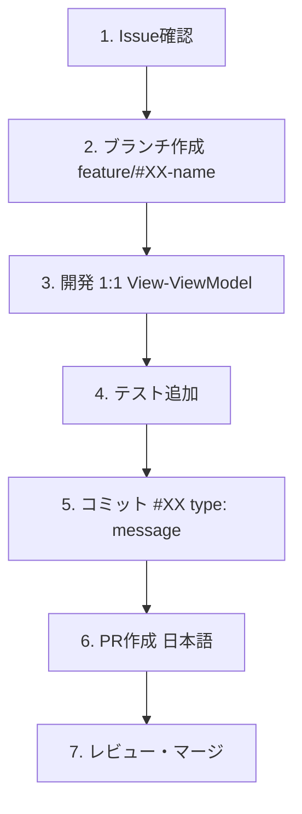

# TimeRabbit クイックスタートガイド

**最終更新**: 2025年10月12日

---

## はじめに

TimeRabbitは、macOS向けのシンプルで直感的な時間記録アプリケーションです。このガイドでは、開発環境のセットアップから最初の機能開発までを案内します。

---

## 前提条件

### 必須環境

- **macOS**: 15.0以降（ビルド環境）
- **Xcode**: 16.1以降
- **Swift**: 5.0
- **Git**: 最新版

### 推奨知識

- Swift/SwiftUI の基礎知識
- MVVM アーキテクチャの理解
- Git/GitHub の基本操作

---

## セットアップ

### 1. リポジトリのクローン

```bash
git clone https://github.com/ITK13201/TimeRabbit.git
cd TimeRabbit
```

### 2. Xcodeでプロジェクトを開く

```bash
open TimeRabbit.xcodeproj
```

### 3. ビルド確認

```bash
# ビルド
xcodebuild -project TimeRabbit.xcodeproj \
  -scheme TimeRabbit \
  -destination 'platform=macOS' \
  build

# テスト実行
xcodebuild test \
  -project TimeRabbit.xcodeproj \
  -scheme TimeRabbit \
  -destination 'platform=macOS' \
  -testPlan TimeRabbitTests
```

**成功すれば開発環境の準備完了です！**

---

## プロジェクト構成の理解

### ディレクトリ構造

```
TimeRabbit/
├── TimeRabbit/           # メインアプリケーション
│   ├── Models.swift      # データモデル
│   ├── repositories/     # データ永続化層
│   ├── viewmodels/       # プレゼンテーション層
│   └── views/            # UI層
├── TimeRabbitTests/      # ユニットテスト
└── docs/                 # ドキュメント
```

詳細は [project-overview.md](project-overview.md) を参照してください。

### アーキテクチャ概要

TimeRabbitは **1:1 View-ViewModel MVVM** パターンを採用しています。



詳細は [architecture-guide.md](architecture-guide.md) を参照してください。

---

## 最初の機能開発

### ステップ1: Issueを確認

```bash
# GitHub IssueをCLIで確認
gh issue list

# 特定のIssueを表示
gh issue view 15
```

### ステップ2: ブランチを作成

```bash
# developブランチから分岐
git checkout develop
git pull origin develop

# feature ブランチ作成
git checkout -b feature/#15-add-some-feature
```

### ステップ3: 開発

#### 1:1 View-ViewModel パターンに従う

```swift
// 1. ViewModel作成
@MainActor
class YourViewModel: BaseViewModel {
  private let repository: YourRepositoryProtocol

  init(repository: YourRepositoryProtocol) {
    self.repository = repository
    super.init()
  }
}

// 2. View作成
struct YourView: View {
  @ObservedObject var viewModel: YourViewModel

  var body: some View {
    // UI実装
  }
}

// 3. ViewModelFactoryに追加
extension ViewModelFactory {
  func createYourViewModel() -> YourViewModel {
    YourViewModel(repository: yourRepository)
  }
}
```

### ステップ4: テストを書く

```swift
import Testing

@Suite("Your Feature Tests")
struct YourFeatureTests {
  @Test("Test description")
  func testSomething() throws {
    let mockRepo = MockYourRepository(withSampleData: false)
    let viewModel = YourViewModel(repository: mockRepo)

    // テスト実装
    #expect(someCondition == true)
  }
}
```

### ステップ5: コミット

```bash
# 変更をステージング
git add .

# コミット（規約に従う）
git commit -m "#15 feature: Add some feature description"
```

### ステップ6: プッシュとPR作成

```bash
# プッシュ
git push origin feature/#15-add-some-feature

# PR作成（日本語）
gh pr create \
  --base develop \
  --title "新機能追加: ○○機能" \
  --body "Closes #15

## 概要
○○機能を追加しました。

## 変更内容
- ○○を実装
- テストを追加
"
```

---

## 開発ワークフロー

### 日常的な開発フロー



詳細は [development-guide.md](development-guide.md) を参照してください。

---

## よく使うコマンド

### ビルド・テスト

```bash
# ビルド
xcodebuild -project TimeRabbit.xcodeproj -scheme TimeRabbit -destination 'platform=macOS' build

# テスト（UnitTestsのみ）
xcodebuild test -project TimeRabbit.xcodeproj -scheme TimeRabbit -destination 'platform=macOS' -testPlan TimeRabbitTests
```

### Git操作

```bash
# 現在の状態確認
git status

# ブランチ一覧
git branch -a

# 最新のdevelopを取得
git checkout develop && git pull origin develop

# コミット履歴確認
git log --oneline --graph
```

### GitHub CLI

```bash
# Issue一覧
gh issue list

# PR一覧
gh pr list

# PR作成
gh pr create --base develop --head feature/#XX-name
```

---

## トラブルシューティング

### ビルドエラー

**エラー**: `No such module 'SwiftData'`

**解決策**: macOS Deployment Targetが14.0以上であることを確認

```bash
# project.pbxprojで確認
grep MACOSX_DEPLOYMENT_TARGET TimeRabbit.xcodeproj/project.pbxproj
```

### テストエラー

**エラー**: `futureTime` validation error

**解決策**: テストデータには過去の日付を使用

```swift
// ❌ NG
let record = TimeRecord(startTime: Date(), ...)

// ✅ OK
let pastDate = Calendar.current.date(byAdding: .day, value: -1, to: Date())!
let record = TimeRecord(startTime: pastDate, ...)
```

### Xcode プロジェクトエラー

**エラー**: `objectVersion 77 requires Xcode 16.1+`

**解決策**: Xcode 16.1以降にアップデート

---

## 次のステップ

### さらに学ぶ

1. **[project-overview.md](project-overview.md)** - プロジェクト全体像
2. **[architecture-guide.md](architecture-guide.md)** - アーキテクチャ詳細
3. **[development-guide.md](development-guide.md)** - 開発ガイド詳細
4. **[../reference/data-models.md](../reference/data-models.md)** - データモデル

### 貢献する

- Issue作成（日本語）
- PR作成（日本語、`Closes #XX`必須）
- コミットメッセージ（英語、`#XX type: message`）

---

## ヘルプ

### ドキュメント

- [docs/README.md](../README.md) - ドキュメント索引
- [CLAUDE.md](../../CLAUDE.md) - Claude Code向けガイド

### コミュニティ

- [GitHub Issues](https://github.com/ITK13201/TimeRabbit/issues)
- [GitHub Discussions](https://github.com/ITK13201/TimeRabbit/discussions)

---

**Happy Coding! 🎉**
