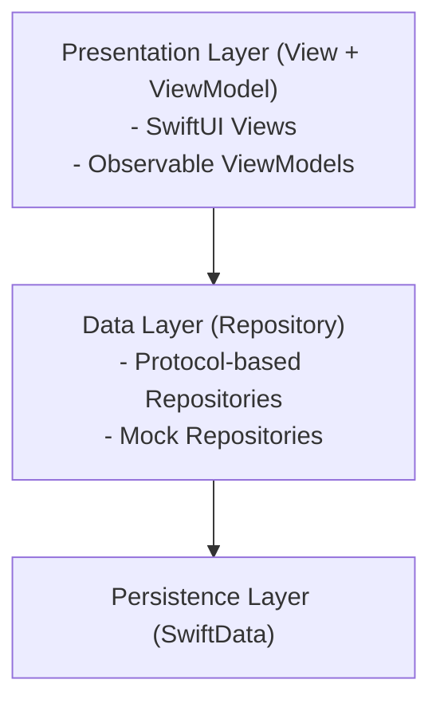
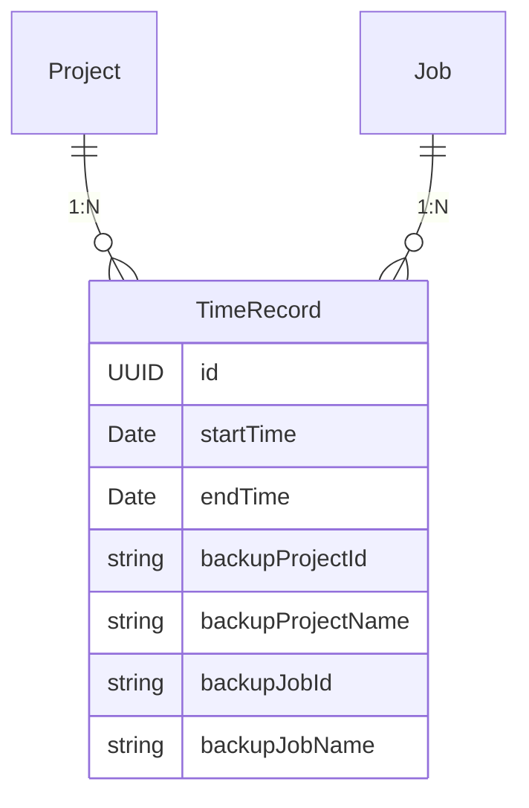

# TimeRabbit プロジェクト概要

**最終更新**: 2025年10月12日

---

## プロジェクト紹介

TimeRabbitは、macOS向けのシンプルで直感的な時間記録アプリケーションです。プロジェクト（案件）と作業区分ごとに時間を追跡し、日次統計を確認できます。

### 主要機能

- **プロジェクト管理**: カラーコード付きでプロジェクトを作成・管理
- **作業区分管理**: 5つの固定作業カテゴリ（開発、保守、POサポート・コンサル、デザイン、その他）
- **時間記録**: プロジェクト×作業区分の組み合わせで時間を記録
- **日次統計**: プロジェクト×作業区分ごとの時間内訳とパーセンテージ
- **データエクスポート**: 統計データをMarkdown形式でコピー可能
- **履歴管理**: 過去の作業記録の表示・編集
- **データ永続化**: SwiftDataによる安全なローカルデータ保存

---

## プロジェクト構成

### ディレクトリ構造

```
TimeRabbit/
├── .github/workflows/      # CI/CD
├── assets/                 # アプリアイコン
├── docs/                   # ドキュメント
├── scripts/                # ビルドスクリプト
├── TimeRabbit/             # メインアプリ
│   ├── Models.swift
│   ├── repositories/
│   ├── viewmodels/
│   └── views/
└── TimeRabbitTests/        # テスト
```

詳細は [../reference/directory-structure.md](../reference/directory-structure.md) を参照してください。

### システム要件

| 項目 | 要件 |
|------|------|
| **macOS** | 14.0以降（アプリ実行） |
| **Xcode** | 16.1以降（ビルド） |
| **Swift** | 5.0 |
| **デプロイターゲット** | macOS 14.0 |

---

## アーキテクチャ概要

TimeRabbitは **1:1 View-ViewModel MVVM** パターンを採用しています。

### レイヤー構成



詳細は [architecture-guide.md](architecture-guide.md) を参照してください。

### 主要コンポーネント

| コンポーネント | 説明 | 例 |
|--------------|------|-----|
| **Models** | SwiftDataモデル | Project, Job, TimeRecord |
| **Repositories** | データ永続化層 | ProjectRepository |
| **ViewModels** | プレゼンテーション層 | ContentViewModel |
| **Views** | UI層 | ContentView |
| **Services** | 共有サービス | DateService, Logger |

---

## 設計思想

TimeRabbitの設計は、以下の原則に基づいています：

### 1. 単一責任の原則（SRP）

各コンポーネントが明確な単一責任を持ちます。

- **View**: UI表示とユーザー操作の受付
- **ViewModel**: ビジネスロジックと状態管理
- **Repository**: データ永続化操作
- **Model**: データ構造の定義

### 2. 統一識別子システム

**2種類の識別子**を厳密に使い分けます：

- **UUID `id`**: システム内部管理用（不変）
- **String `projectId/jobId`**: ビジネスロジック用（可変）

```swift
// ✅ 正しい使用例
projects.removeAll { $0.id == project.id }        // UUID for identity
let proj = projects.first { $0.projectId == "PRJ001" } // String for business logic
```

### 3. 防御的設計

TimeRecordは、ProjectやJobが削除されても情報を保持します（バックアップフィールド）。

### 4. テスト可能性

全Repositoryにプロトコルとモック実装があり、完全な依存性注入を実現しています。

詳細は [architecture-guide.md](architecture-guide.md) の設計思想セクションを参照してください。

---

## データモデル

### モデル関係図



### 主要モデル

| モデル | 説明 | 主要フィールド |
|-------|------|--------------|
| **Project** | 案件 | `id`, `projectId`, `name`, `color` |
| **Job** | 作業区分 | `id`, `jobId`, `name` (固定5種類) |
| **TimeRecord** | 時間記録 | `id`, `startTime`, `endTime`, `project`, `job` |

詳細は [../reference/data-models.md](../reference/data-models.md) を参照してください。

---

## 開発フロー

### Git運用


**ブランチ戦略:**
- `main`: 本番リリース
- `develop`: 統合ブランチ
- `feature/#XX-name`: 機能開発

**コミット規約:**
```
#[issue_number] [type]: [message]
```

例: `#15 feature: Add dark mode toggle`

詳細は [development-guide.md](development-guide.md) を参照してください。

### CI/CD

- **CI**: PR/main pushでユニットテスト実行（macOS 15, Xcode 16.4）
- **Release**: タグpushで自動ビルド・GitHub Release公開

詳細は [../operations/ci-cd.md](../operations/ci-cd.md) を参照してください。

---

## 技術スタック

### コア技術

| 技術 | バージョン | 用途 |
|------|-----------|------|
| Swift | 5.0 | 言語 |
| SwiftUI | macOS 14.0+ | UI |
| SwiftData | macOS 14.0+ | 永続化 |
| Combine | macOS 14.0+ | リアクティブ |
| OSLog | macOS 14.0+ | ロギング |

### 開発ツール

- **Xcode**: 16.1+ (objectVersion 77)
- **Swift Testing**: ユニットテスト
- **GitHub Actions**: CI/CD

詳細は [../reference/tech-stack.md](../reference/tech-stack.md) を参照してください。

---

## クイックリファレンス

### よく使うコマンド

```bash
# ビルド
xcodebuild -project TimeRabbit.xcodeproj -scheme TimeRabbit -destination 'platform=macOS' build

# テスト（UnitTestsのみ）
xcodebuild test -project TimeRabbit.xcodeproj -scheme TimeRabbit -destination 'platform=macOS' -testPlan TimeRabbitTests

# ブランチ作成
git checkout -b feature/#XX-description

# コミット
git commit -m "#XX feature: Description"

# PR作成
gh pr create --base develop --title "タイトル（日本語）" --body "Closes #XX"
```

---

## ドキュメント索引

### ガイド

- **[getting-started.md](getting-started.md)** - クイックスタート
- **[architecture-guide.md](architecture-guide.md)** - アーキテクチャ詳細
- **[development-guide.md](development-guide.md)** - 開発ガイド

### リファレンス

- **[../reference/data-models.md](../reference/data-models.md)** - データモデル詳細
- **[../reference/tech-stack.md](../reference/tech-stack.md)** - 技術スタック詳細
- **[../reference/design-patterns.md](../reference/design-patterns.md)** - 設計パターン

### 設計書

- **[../design/](../design/)** - 時系列設計ドキュメント

### 運用

- **[../operations/ci-cd.md](../operations/ci-cd.md)** - CI/CD
- **[../operations/release-procedure.md](../operations/release-procedure.md)** - リリース手順

---

## 貢献

TimeRabbitへの貢献を歓迎します！

1. Issue作成（日本語）
2. ブランチ作成（`feature/#XX-name`）
3. 開発・テスト
4. PR作成（日本語、`Closes #XX`）

詳細は [development-guide.md](development-guide.md) を参照してください。

---

## ライセンス

MIT License - 詳細は [LICENSE](../../LICENSE) を参照してください。

---

## サポート

- **Issues**: [GitHub Issues](https://github.com/ITK13201/TimeRabbit/issues)
- **Discussions**: [GitHub Discussions](https://github.com/ITK13201/TimeRabbit/discussions)
- **Documentation**: [docs/README.md](../README.md)
