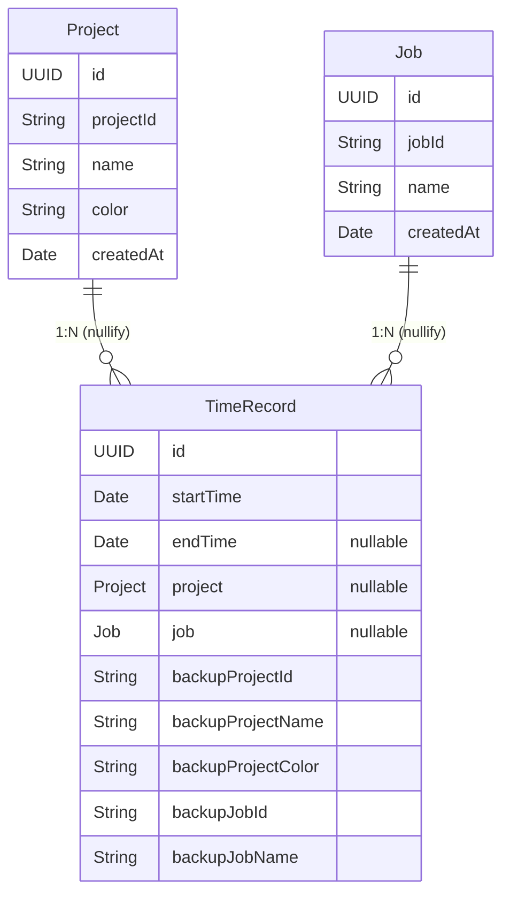

# TimeRabbit データモデル

**最終更新**: 2025年10月12日

---

## モデル関係図



---

## Project モデル

### 定義

```swift
@Model
final class Project {
  var id: UUID             // システム内部管理用の一意識別子
  var projectId: String    // ユーザー編集可能な案件ID
  var name: String         // 案件名
  var color: String        // カラーコード
  var createdAt: Date

  @Relationship(deleteRule: .nullify, inverse: \TimeRecord.project)
  var timeRecords: [TimeRecord] = []

  init(projectId: String, name: String, color: String = "blue") {
    self.id = UUID()
    self.projectId = projectId
    self.name = name
    self.color = color
    self.createdAt = Date()
  }
}
```

### フィールド説明

| フィールド | 型 | 説明 |
|-----------|-------|------|
| `id` | UUID | システム内部の一意識別子（自動生成、不変） |
| `projectId` | String | ユーザー定義の案件ID（3-20文字、一意性制約あり） |
| `name` | String | 案件名（ユーザー表示用） |
| `color` | String | カラーコード（UI表示用） |
| `createdAt` | Date | 作成日時 |
| `timeRecords` | [TimeRecord] | 関連する時間記録（逆参照） |

### 関係定義

```swift
@Relationship(deleteRule: .nullify, inverse: \TimeRecord.project)
```

**意味:**
- Projectが削除されても、TimeRecordは保持される（`.nullify`）
- TimeRecordの`project`フィールドが`nil`になる
- バックアップフィールドで削除後も情報を表示可能

---

## Job モデル

### 定義

```swift
@Model
final class Job {
  var id: UUID             // システム内部管理用の一意識別子
  var jobId: String        // 固定値: "001", "002", "003", "006", "999"
  var name: String         // 固定値: 対応する作業区分名
  var createdAt: Date

  @Relationship(deleteRule: .nullify, inverse: \TimeRecord.job)
  var timeRecords: [TimeRecord] = []

  init(jobId: String, name: String) {
    self.id = UUID()
    self.jobId = jobId
    self.name = name
    self.createdAt = Date()
  }

  // 固定の作業区分一覧
  static let predefinedJobs = [
    ("001", "開発"),
    ("002", "保守"),
    ("003", "POサポート・コンサル"),
    ("006", "デザイン"),
    ("999", "その他")
  ]
}
```

### フィールド説明

| フィールド | 型 | 説明 |
|-----------|-------|------|
| `id` | UUID | システム内部の一意識別子（自動生成、不変） |
| `jobId` | String | 作業区分ID（固定値: "001", "002", "003", "006", "999"） |
| `name` | String | 作業区分名（固定値: 対応する日本語名） |
| `createdAt` | Date | 作成日時 |
| `timeRecords` | [TimeRecord] | 関連する時間記録（逆参照） |

### 固定Job定義

| jobId | name | 説明 |
|-------|------|------|
| "001" | 開発 | 開発作業 |
| "002" | 保守 | 保守作業 |
| "003" | POサポート・コンサル | POサポート・コンサルティング |
| "006" | デザイン | デザイン作業 |
| "999" | その他 | その他の作業 |

**注意:**
- Jobはアプリ起動時に自動初期化
- ユーザーは追加・削除不可（固定リスト）
- `JobRepository.initializePredefinedJobs()`で初期化

---

## TimeRecord モデル

### 定義

```swift
@Model
final class TimeRecord {
  var id: UUID
  var startTime: Date
  var endTime: Date?

  // Primary relationships
  var project: Project?
  var job: Job?

  // Backup data for deleted entities
  var backupProjectId: String
  var backupProjectName: String
  var backupProjectColor: String
  var backupJobId: String
  var backupJobName: String

  var duration: TimeInterval {
    let end = endTime ?? Date()
    return end.timeIntervalSince(startTime)
  }

  // Display properties
  var displayProjectId: String { project?.projectId ?? backupProjectId }
  var displayProjectName: String { project?.name ?? backupProjectName }
  var displayProjectColor: String { project?.color ?? backupProjectColor }
  var displayJobId: String { job?.jobId ?? backupJobId }
  var displayJobName: String { job?.name ?? backupJobName }

  init(startTime: Date, project: Project, job: Job) {
    self.id = UUID()
    self.startTime = startTime
    self.project = project
    self.job = job

    // Backup data
    self.backupProjectId = project.projectId
    self.backupProjectName = project.name
    self.backupProjectColor = project.color
    self.backupJobId = job.jobId
    self.backupJobName = job.name
  }
}
```

### フィールド説明

| フィールド | 型 | 説明 |
|-----------|-------|------|
| `id` | UUID | システム内部の一意識別子（自動生成） |
| `startTime` | Date | 開始時刻 |
| `endTime` | Date? | 終了時刻（進行中の場合は`nil`） |
| `project` | Project? | 関連するProject（削除時は`nil`） |
| `job` | Job? | 関連するJob（削除時は`nil`） |
| `backupProjectId` | String | Projectのバックアップ（projectId） |
| `backupProjectName` | String | Projectのバックアップ（name） |
| `backupProjectColor` | String | Projectのバックアップ（color） |
| `backupJobId` | String | Jobのバックアップ（jobId） |
| `backupJobName` | String | Jobのバックアップ（name） |

### 計算プロパティ

| プロパティ | 型 | 説明 |
|-----------|-------|------|
| `duration` | TimeInterval | 記録時間（秒）。進行中は現在時刻まで |
| `displayProjectId` | String | 表示用ProjectID（削除後はバックアップ） |
| `displayProjectName` | String | 表示用Project名（削除後はバックアップ） |
| `displayProjectColor` | String | 表示用Projectカラー（削除後はバックアップ） |
| `displayJobId` | String | 表示用JobID（削除後はバックアップ） |
| `displayJobName` | String | 表示用Job名（削除後はバックアップ） |

### バックアップ機構

**目的:**
- ProjectやJobが削除されても、TimeRecordの表示情報を保持

**動作:**
1. TimeRecord作成時、Project/Jobの情報をバックアップフィールドにコピー
2. Project/Jobが削除されると、`project`/`job`が`nil`になる（`.nullify`）
3. 表示時は`display*`プロパティを使用（バックアップから自動取得）

**例:**
```swift
// Projectが存在する場合
record.displayProjectId  // → project.projectId を返す

// Projectが削除された場合
record.displayProjectId  // → backupProjectId を返す
```

---

## SwiftData関係定義

### Project → TimeRecord

```swift
@Relationship(deleteRule: .nullify, inverse: \TimeRecord.project)
var timeRecords: [TimeRecord] = []
```

**削除ルール:**
- `.nullify`: Projectが削除されても、TimeRecordは保持
- TimeRecordの`project`フィールドが`nil`に設定

### Job → TimeRecord

```swift
@Relationship(deleteRule: .nullify, inverse: \TimeRecord.job)
var timeRecords: [TimeRecord] = []
```

**削除ルール:**
- `.nullify`: Jobが削除されても、TimeRecordは保持
- TimeRecordの`job`フィールドが`nil`に設定

---

## データ整合性の保証

### 識別子の使い分け

| 操作 | 使用する識別子 | 理由 |
|------|--------------|------|
| オブジェクト削除 | `id` (UUID) | 不変な識別子で確実に同一オブジェクトを特定 |
| ビジネスロジック検索 | `projectId` / `jobId` | ユーザー定義IDでの検索・集計 |
| 統計集計 | `projectId` / `jobId` | 同一案件・作業区分のグルーピング |
| UI表示 | `projectId` / `jobId` | ユーザーに意味のある識別子 |

### 一意性制約

**ProjectId:**
- アプリレベルで一意性を検証（`isProjectIdUnique()`）
- 3-20文字の範囲制限
- 編集時は自身を除外して重複チェック

**JobId:**
- 固定値（"001", "002", "003", "006", "999"）
- 初期化時に自動作成
- ユーザーによる追加・削除不可

---

## 時間検証ルール

`TimeRecordRepository.validateTimeRange()`が以下を検証：

| 検証項目 | ルール | エラー |
|---------|-------|--------|
| 時刻順序 | startTime < endTime | `invalidTimeRange` |
| 未来時刻 | endTime <= Date() | `futureTime` |
| 最小時間 | duration >= 60秒 | `tooShort` |
| 最大時間 | duration <= 24時間 | `tooLong` |
| 重複 | 60秒以内の重複は許容 | `overlappingTimeRange` |

**注意:**
- テストデータは過去日付を使用すること
- 60秒の許容範囲により、現実的な使用パターンに対応

---

## 関連ドキュメント

- [architecture-overview.md](architecture-overview.md): アーキテクチャ詳細
- [design-philosophy.md](design-philosophy.md): 設計思想（識別子システム、防御的設計）
- [development/architecture/20251008-project-job-systemid-design.md](development/architecture/20251008-project-job-systemid-design.md): 識別子システム設計詳細
- [development/architecture/20250930-project-job-model-redesign.md](development/architecture/20250930-project-job-model-redesign.md): モデル再設計
